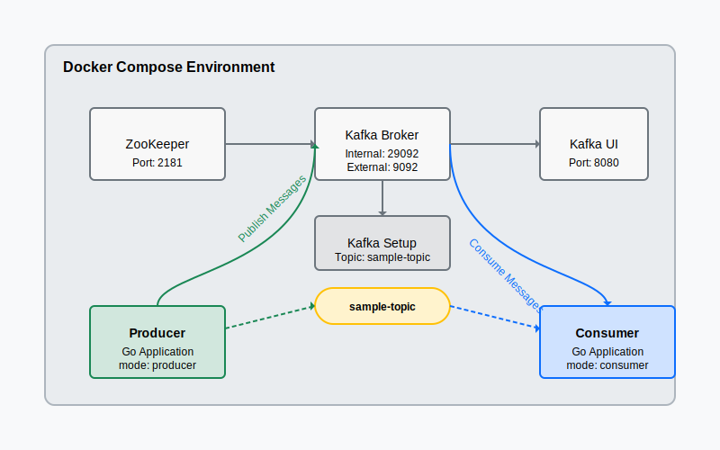

# Go Kafka Application

Goで実装されたKafkaプロデューサーとコンシューマーのサンプルアプリケーションです。DockerとDocker Composeを使用して、Kafka環境とアプリケーションを簡単に起動できます。

## アーキテクチャ

このアプリケーションは以下のコンポーネントで構成されています：



- **ZooKeeper**: Kafkaクラスターの管理に使用されます（ポート: 2181）
- **Kafka Broker**: メッセージブローカー（内部ポート: 29092、外部ポート: 9092）
- **Kafka UI**: Kafkaの監視・管理用Webインターフェース（ポート: 8080）
- **Kafka Setup**: 起動時にトピックを作成する初期化コンテナ
- **Producer**: メッセージを生成・送信するGoアプリケーション
- **Consumer**: メッセージを受信・処理するGoアプリケーション

アプリケーションは単一のGoコードベースで構成され、コマンドライン引数（-mode）によってプロデューサーまたはコンシューマーとして動作します。

## 前提条件

- Docker
- Docker Compose
- Go 1.23以上（ローカル実行の場合）

## クイックスタート

### Docker Composeでの実行

すべてのサービスを一度に起動：

```bash
make up
```

ログの確認：

```bash
# プロデューサーのログを確認
make logs-producer

# コンシューマーのログを確認
make logs-consumer
```

環境の停止：

```bash
make down
```

### ローカルでの実行

Kafka環境を起動：

```bash
make kafka
```

プロデューサーの実行：

```bash
make run-producer
```

コンシューマーの実行（別のターミナルで）：

```bash
make run-consumer
```

## アプリケーションの詳細

### メッセージ構造

アプリケーションは以下の構造のJSONメッセージを送受信します：

```json
{
  "id": 1,
  "content": "これはメッセージ #1",
  "timestamp": "2025-03-04T09:30:00Z"
}
```

### 設定

以下の環境変数を使用して設定を変更できます：

- `KAFKA_BROKERS`: Kafkaブローカーの接続先（デフォルト: "localhost:9092"）

Docker Composeを使用する場合、環境変数は自動的に設定されます。

## モニタリング

Kafka UIを使用してトピックやメッセージを確認できます：

```
http://localhost:8080
```

## ディレクトリ構成

```
kafka-go-app/
  ├── Dockerfile          # Goアプリケーション用のDockerfile
  ├── docker-compose.yml  # 全環境のDocker Compose設定
  ├── go.mod              # Go依存関係の定義
  ├── go.sum              # Go依存関係のバージョン
  ├── main.go             # アプリケーションのメインコード
  └── Makefile            # 便利なコマンド集
```

## 開発

### 依存関係の追加

```bash
make deps
```

### ビルド

```bash
make build
```

## 関連リソース

- [Apache Kafka](https://kafka.apache.org/)
- [segmentio/kafka-go](https://github.com/segmentio/kafka-go)
- [Confluent Kafka Docker Images](https://hub.docker.com/r/confluentinc/cp-kafka/)
